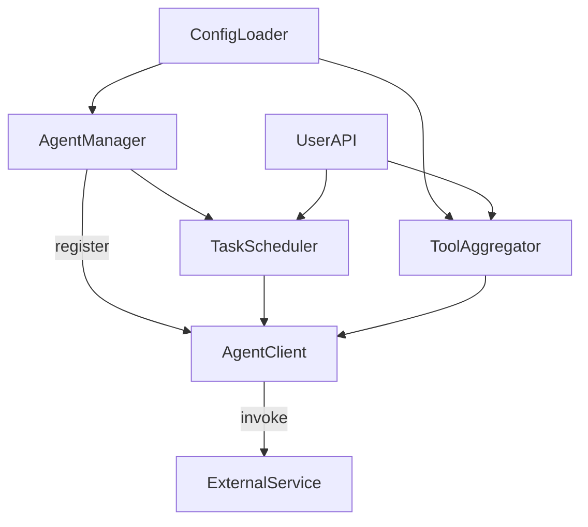
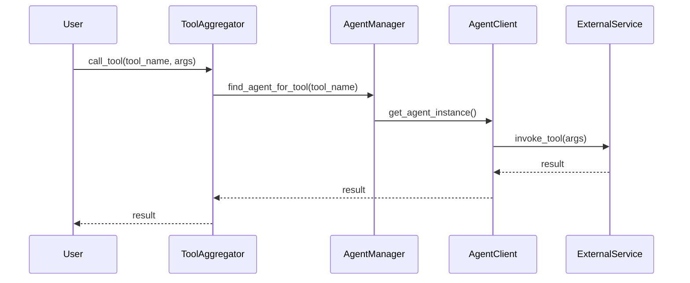

# Architecture of MCP Agent Orchestration System

## High-Level Architecture Diagram

## Module Descriptions

- **ConfigLoader**: Loads and validates agent/tool configuration from YAML/JSON. Supports hot-reload.
- **AgentManager**: Registers, initializes, and manages the lifecycle of all agent backends. Handles dynamic agent registration/unregistration.
- **AgentClient**: Abstract base for all agent integrations (e.g., Claude, ChatGPT, REST tools). Each agent type implements this interface.
- **TaskScheduler**: Manages task queue, prioritization, dependency resolution, and assignment to agents. Supports retries and timeouts.
- **ToolAggregator**: Aggregates all available tools from registered agents, exposes unified API for discovery and invocation.
- **UserAPI**: (Optional) REST/gRPC/WebSocket API for external clients to submit tasks, query status, and invoke tools.
- **ExternalService**: Any LLM API or custom tool backend (Claude, ChatGPT, etc.).

## Data Flow: Task Submission & Execution

1. User submits a task via UserAPI or direct call.
2. ConfigLoader ensures agent/tool config is loaded.
3. TaskScheduler queues the task, resolves dependencies and priority.
4. AgentManager selects or instantiates the appropriate AgentClient.
5. TaskScheduler assigns the task to AgentClient.
6. AgentClient invokes the external service/tool.
7. Result is returned to TaskScheduler, then to UserAPI.

## Sequence Diagram: Tool Invocation

## State Transitions

- **Task**: pending → running → completed/failed
- **Agent**: registered → available/busy → error/unregistered

## Extensibility Points

- Add new agent types by subclassing AgentClient and updating config
- Add new tool types by extending ToolAggregator logic
- Support for new APIs by extending UserAPI

## Future Work / TODOs
- Distributed TaskScheduler for horizontal scaling
- Pluggable authentication and rate limiting
- Web dashboard for live monitoring
- Advanced scheduling algorithms (load, cost, capability-aware)
- Streaming and async tool invocation 